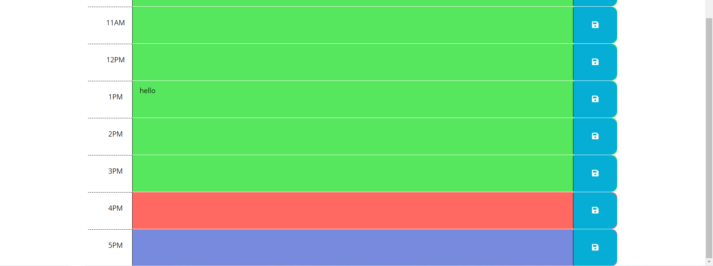

# Week5-WeeklyPlanner

This weeks homework was to work with starter code to make a dynamic weekly planner that has the current date at the top, allows you to save what you type in each time block to the local storage, and has color coding for past present and future times. Below are screenshots of the working application as well as a link to the deployed application.

[Weekly Planner](https://brob92993.github.io/Week5-WeeklyPlanner/)

